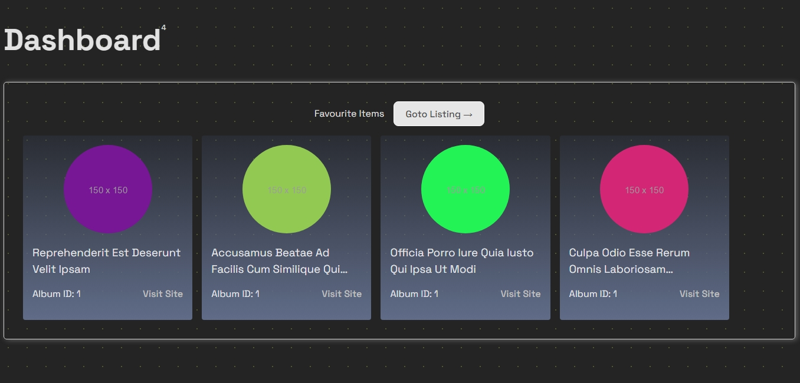
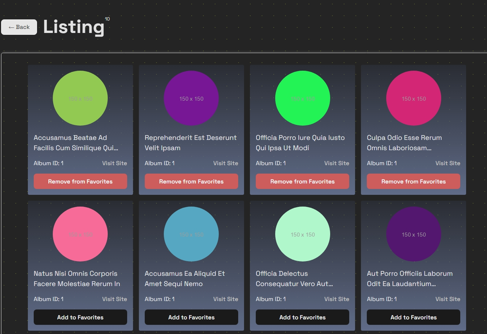

# The Album task using ReactJS, Sass and Context API.

## Features

- Load a list of elements from an API.
- Each element displays ID, title, image, and an "Add to Favorites" button.
- Favorites are stored in the application state.
- Favorites persist across page visits.
- The dashboard page displays all favorite items.

## Technologies Used

- React
- TypeScript
- Context API
- JSONPlaceholder API (for demo data)

